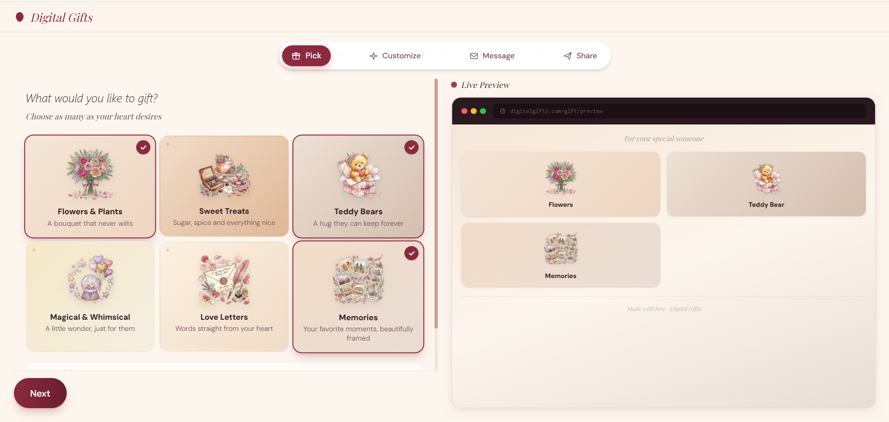
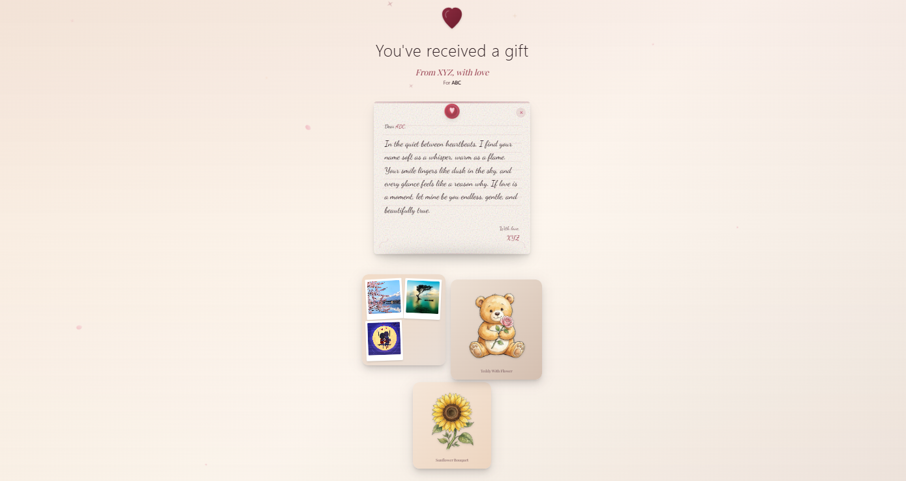

<div align="center">

# 🎁 Digital Gifts

### *Create beautiful, personalized digital gifts for your loved ones*

<br/>


<br/>

> 💌 *Because the best gifts come from the heart — not a shopping cart.*

<br/>

[✨ Live Demo](https://digitalgifts.vercel.app) · [🐛 Report a Bug](https://github.com/yourusername/digitalgifts/issues) · [💡 Request a Feature](https://github.com/yourusername/digitalgifts/issues)

</div>

---

## 📸 Screenshots

<div align="center">

### 🏠 Landing Page


### 🛠️ Gift Builder


### 🎀 Gift Reveal


</div>

---

## 💫 About

**Digital Gifts** is a romantic web application that lets you create and share personalized virtual presents. Instead of physical gifts, send your loved ones beautiful digital bouquets, sweet treats, teddy bears, magical items, love letters, or cherished photo memories — all wrapped in a delightful unwrapping experience. 🌸

---

## ✨ Features

### 🎀 Gift Categories

| 🎁 Category | 📝 Description |
|:-----------:|----------------|
| 💐 **Flowers** | A bouquet that never wilts — Rose, Peony, Wildflower, Tulip, Sunflower |
| 🍫 **Sweet Treats** | Sugar, spice and everything nice — Chocolate Box, Cupcakes, Macarons, Cookie Jar, Cake |
| 🧸 **Teddy Bears** | A hug they can keep forever — Heart, Flower, Balloon, Gift Box variants |
| ✨ **Magical** | A little wonder, just for them — Snow Globe, Floating Balloons, Wishing Lantern, Jar of Stars |
| 💌 **Love Letters** | Words straight from your heart — Parchment Scroll, Sealed Envelope, Open Letter |
| 📷 **Memories** | Upload up to 6 photos with captions — Polaroid Wall, Photo Strip, Scrapbook, Memory Jar |

### 🚀 Core Features

- 🧙 **Multi-Step Gift Builder** — Intuitive 4-step wizard (Pick → Customize → Message → Share)
- 👁️ **Live Preview** — See your gift come together in real-time as you build it
- 🎨 **Multiple Gift Items** — Combine different gift types into one package
- 🎊 **Beautiful Reveal Animation** — Recipients experience a delightful gift unwrapping animation
- 🔗 **Shareable Links** — Each gift gets a unique URL to share with your loved one
- 🖼️ **Photo Memories** — Upload personal photos with captions for the memory gift type
- 📱 **Fully Responsive** — Works beautifully on mobile, tablet, and desktop

---

## 🛠️ Tech Stack

| Layer | Technology |
|-------|------------|
| ⚡ Framework | [Next.js 16](https://nextjs.org/) (App Router) |
| 🔷 Language | [TypeScript](https://www.typescriptlang.org/) |
| 🎨 Styling | [Tailwind CSS 4](https://tailwindcss.com/) |
| 🌀 Animations | [Framer Motion](https://www.framer.com/motion/) |
| 🗄️ Database & Storage | [Supabase](https://supabase.com/) |
| 🚀 Deployment | [Vercel](https://vercel.com/) |

---

## 🏁 Getting Started

### 📋 Prerequisites

- Node.js 18+
- npm, yarn, pnpm, or bun
- A [Supabase](https://supabase.com/) account

### ⚙️ Installation

**1. Clone the repository**
```bash
git clone https://github.com/yourusername/digitalgifts.git
cd digitalgifts
```

**2. Install dependencies**
```bash
npm install
# or
yarn install
# or
pnpm install
```

**3. Set up environment variables**

Create a `.env.local` file in the root directory:
```env
NEXT_PUBLIC_SUPABASE_URL=your_supabase_project_url
NEXT_PUBLIC_SUPABASE_ANON_KEY=your_supabase_anon_key
```

**4. Set up Supabase**

Create the following tables in your Supabase project:

- 🗃️ `gifts` — Stores gift metadata (id, from_name, to_name, message, created_at)
- 🗃️ `gift_items` — Stores individual gift items (id, gift_id, type, content, position)
- 🗃️ `gift_photos` — Stores photo references (id, gift_item_id, storage_path, caption, position)

Create a storage bucket named **`digitalgifts-photos`** for photo uploads.

**5. Run the development server**
```bash
npm run dev
```

**6.** 🎉 Open [http://localhost:3000](http://localhost:3000) in your browser!

---

## 📁 Project Structure

```
digitalgifts/
├── 📂 app/
│   ├── 📂 api/
│   │   ├── 📂 gifts/          # Gift creation API
│   │   └── 📂 photos/         # Photo upload API
│   ├── 📂 build/              # Gift builder page
│   ├── 📂 gift/[id]/          # Gift reveal page
│   ├── layout.tsx
│   └── page.tsx               # Landing page
├── 📂 components/
│   ├── 📂 builder/            # Builder wizard components
│   │   ├── StepPicker.tsx
│   │   ├── StepCustomize.tsx
│   │   ├── StepMessage.tsx
│   │   ├── StepShare.tsx
│   │   └── LivePreview.tsx
│   ├── 📂 reveal/             # Gift reveal components
│   │   ├── RibbonAnimation.tsx
│   │   ├── FloatingLetter.tsx
│   │   ├── GiftGrid.tsx
│   │   └── GiftModal.tsx
│   └── 📂 ui/                 # Reusable UI components
├── 📂 lib/
│   ├── supabase.ts            # Supabase client
│   ├── types.ts               # TypeScript interfaces
│   └── nanoid.ts              # ID generation
└── 📂 public/
    ├── 📂 illustrations/      # Gift category illustrations
    └── 📂 screenshots/        # README screenshots ← add yours here
```

---

## 🤝 Contributing

Contributions are welcome! 🙌

1. 🍴 Fork the repository
2. 🌿 Create your feature branch (`git checkout -b feature/amazing-feature`)
3. 💾 Commit your changes (`git commit -m 'Add some amazing feature'`)
4. 📤 Push to the branch (`git push origin feature/amazing-feature`)
5. 🔁 Open a Pull Request

---

## 📄 License

This project is open source and available under the [MIT License](LICENSE). 📝

---

<div align="center">

<br/>

💝 *Inspired by love. Built with heart.*

<br/>

⭐ **If you like this project, give it a star!** ⭐

</div>
